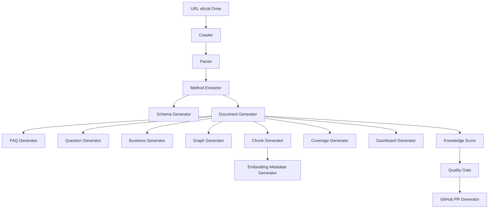

# Arquitetura

## Objetivo

Definir uma arquitetura modular para gerar automaticamente conhecimento Enterprise a partir de documentação oficial da Omie.

## Módulos

## Contratos

- Entrada mínima: URL oficial Omie.
- Saída mínima: documentos Markdown, schemas, GraphRAG, business knowledge, perguntas, chunks, coverage, dashboard e relatório de score.
- Toda saída deve distinguir `Documentado oficialmente` de `Necessita validação`.

## Módulos independentes

- Crawler: captura conteúdo bruto autorizado.
- Parser: converte HTML/documentação em estrutura intermediária.
- Method Extractor: identifica métodos, tipos de entrada e retorno.
- Schema Generator: cria JSON Schemas iniciais.
- Business Generator: escreve contexto operacional.
- Graph Generator: cria Mermaid/GraphRAG.
- Question Generator: produz perguntas naturais.
- FAQ Generator: produz FAQ por método.
- Chunk Generator: cria chunks RAG.
- Embedding Metadata Generator: adiciona metadados de embeddings.
- Coverage Generator: atualiza matriz de cobertura.
- Dashboard Generator: atualiza métricas.
- Knowledge Score: avalia qualidade.
- GitHub PR Generator: abre PR sem merge automático.

