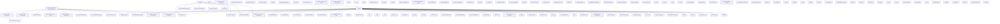

# Service Dependency Graph

```mermaid
graph TD
  svc_geral_clientes_fornecedores_transportadoras_etc["Clientes, Fornecedores, Transportadoras, etc"]
  svc_financas_contas_a_receber_lancamentos["Contas a Receber - Lançamentos"]
  svc_geral_clientes_fornecedores_transportadoras_etc --> svc_financas_contas_a_receber_lancamentos
  svc_financas_contas_a_pagar_lancamentos["Contas a Pagar - Lançamentos"]
  svc_geral_clientes_fornecedores_transportadoras_etc --> svc_financas_contas_a_pagar_lancamentos
  svc_geral_categorias["Categorias"]
  svc_servicos_e_nfs_e_ordens_de_servico["Ordens de Serviço"]
  svc_geral_clientes_fornecedores_transportadoras_etc --> svc_servicos_e_nfs_e_ordens_de_servico
  svc_servicos_e_nfs_e_ordens_de_servico_fat_em_lote["Ordens de Serviço - Fat. em Lote"]
  svc_geral_clientes_fornecedores_transportadoras_etc --> svc_servicos_e_nfs_e_ordens_de_servico_fat_em_lote
  svc_servicos_e_nfs_e_ordens_de_servico_faturamento["Ordens de Serviço - Faturamento"]
  svc_geral_clientes_fornecedores_transportadoras_etc --> svc_servicos_e_nfs_e_ordens_de_servico_faturamento
  svc_geral_clientes_caracteristicas["Clientes - Características"]
  svc_geral_clientes_fornecedores_transportadoras_etc --> svc_geral_clientes_caracteristicas
  svc_financas_contas_a_receber_boletos["Contas a Receber - Boletos"]
  svc_geral_clientes_fornecedores_transportadoras_etc --> svc_financas_contas_a_receber_boletos
  svc_financas_contas_a_receber_pix["Contas a Receber - PIX"]
  svc_geral_clientes_fornecedores_transportadoras_etc --> svc_financas_contas_a_receber_pix
  svc_geral_bancos["Bancos"]
  svc_financas_contas_correntes_lancamentos["Contas Correntes - Lançamentos"]
  svc_financas_extrato_de_conta_corrente["Extrato de Conta Corrente"]
  svc_financas_orcamento_de_caixa["Orçamento de Caixa"]
  svc_financas_pesquisar_titulos["Pesquisar Títulos"]
  svc_financas_resumo["Resumo"]
  svc_servicos_e_nfs_e_classificacao_do_servico["Classificação do Serviço"]
  svc_servicos_e_nfs_e_consultas["Consultas"]
  svc_servicos_e_nfs_e_contratos_de_servico["Contratos de Serviço"]
  svc_servicos_e_nfs_e_contratos_de_servico_fat_em_lote["Contratos de Serviço - Fat. em Lote"]
  svc_servicos_e_nfs_e_contratos_de_servico_faturamento["Contratos de Serviço - Faturamento"]
  svc_servicos_e_nfs_e_ibpt["IBPT"]
  svc_servicos_e_nfs_e_lc_116["LC 116"]
  svc_servicos_e_nfs_e_nbs["NBS"]
  svc_servicos_e_nfs_e_obter_documentos["Obter Documentos"]
  svc_servicos_e_nfs_e_resumo["Resumo"]
  svc_servicos_e_nfs_e_servicos["Serviços"]
  svc_servicos_e_nfs_e_servicos_no_municipio["Serviços no Município"]
  svc_servicos_e_nfs_e_tipo_de_faturamento_de_contrato["Tipo de Faturamento de Contrato"]
  svc_servicos_e_nfs_e_tipo_de_utilizacao["Tipo de utilização"]
  svc_servicos_e_nfs_e_tipos_de_tributacao["Tipos de Tributação"]
  svc_crm_contas_caracteristicas["Contas - Características"]
  svc_geral_departamentos["Departamentos"]
  svc_geral_projetos["Projetos"]
  svc_geral_vendedores["Vendedores"]
  svc_geral_bandeiras_de_cartao["Bandeiras de Cartão"]
  svc_geral_cenario_de_impostos["Cenário de Impostos"]
  svc_geral_cidades["Cidades"]
  svc_geral_contas_correntes["Contas Correntes"]
  svc_geral_contas_do_dre["Contas do DRE"]
  svc_geral_documentos_anexos["Documentos Anexos"]
  svc_geral_empresas["Empresas"]
  svc_geral_familias_de_produto["Familias de Produto"]
  svc_geral_finalidade_de_transferencia["Finalidade de Transferência"]
  svc_geral_meios_de_pagamento["Meios de Pagamento"]
  svc_geral_motivos_de_devolucao["Motivos de Devolução"]
  svc_geral_origem_do_pedido["Origem do Pedido"]
  svc_geral_origem_do_titulos["Origem do títulos"]
  svc_geral_paises["Países"]
  svc_geral_parcelas["Parcelas"]
  svc_geral_tags["Tags"]
  svc_geral_tarefas["Tarefas"]
  svc_geral_tipo_de_assinante["Tipo de Assinante"]
  svc_geral_tipo_de_entrega["Tipo de Entrega"]
  svc_geral_tipos_de_anexos["Tipos de Anexos"]
  svc_geral_tipos_de_atividade_da_empresa["Tipos de Atividade da Empresa"]
  svc_geral_tipos_de_contas_correntes["Tipos de Contas Correntes"]
  svc_geral_tipos_de_documento["Tipos de Documento"]
  svc_geral_unidades["Unidades"]
  svc_crm_concorrentes["Concorrentes"]
  svc_crm_contas["Contas"]
  svc_crm_contatos["Contatos"]
  svc_crm_fases["Fases"]
  svc_crm_finders["Finders"]
  svc_crm_motivos["Motivos"]
  svc_crm_oportunidades["Oportunidades"]
  svc_crm_oportunidades_resumo["Oportunidades - Resumo"]
  svc_crm_origens["Origens"]
  svc_crm_parceiros["Parceiros"]
  svc_crm_pre_vendas["Pré-Vendas"]
  svc_crm_solucoes["Soluções"]
  svc_crm_status["Status"]
  svc_crm_tarefas["Tarefas"]
  svc_crm_tarefas_resumo["Tarefas - Resumo"]
  svc_crm_telemarketing["Telemarketing"]
  svc_crm_tipos["Tipos"]
  svc_crm_tipos_de_tarefas["Tipos de Tarefas"]
  svc_crm_usuarios["Usuários"]
  svc_crm_vendedores["Vendedores"]
  svc_crm_verticais["Verticais"]
  svc_cadastros_auxiliares_documentos_fiscais["Documentos Fiscais"]
  svc_cadastros_auxiliares_resumo["Resumo"]
  svc_geral_produtos["Produtos"]
  svc_geral_categorias --> svc_geral_produtos
  svc_financas_movimentos_financeiros["Movimentos Financeiros"]
  svc_financas_contas_a_pagar_lancamentos --> svc_financas_movimentos_financeiros
  svc_financas_contas_a_receber_lancamentos --> svc_financas_movimentos_financeiros
  svc_geral_caracteristicas_de_produtos["Características de produtos"]
  svc_geral_categorias --> svc_geral_caracteristicas_de_produtos
  svc_geral_produtos_caracteristicas["Produtos - Características"]
  svc_geral_categorias --> svc_geral_produtos_caracteristicas
  svc_geral_produtos_estrutura["Produtos - Estrutura"]
  svc_geral_categorias --> svc_geral_produtos_estrutura
  svc_geral_produtos_kit["Produtos - Kit"]
  svc_geral_categorias --> svc_geral_produtos_kit
  svc_compras_estoque_e_producao_pedidos_de_venda["Pedidos de Venda"]
  svc_geral_clientes_fornecedores_transportadoras_etc --> svc_compras_estoque_e_producao_pedidos_de_venda
  svc_geral_produtos --> svc_compras_estoque_e_producao_pedidos_de_venda
  svc_compras_estoque_e_producao_pedidos_de_venda_etapas["Pedidos de Venda - Etapas"]
  svc_geral_clientes_fornecedores_transportadoras_etc --> svc_compras_estoque_e_producao_pedidos_de_venda_etapas
  svc_geral_produtos --> svc_compras_estoque_e_producao_pedidos_de_venda_etapas
  svc_compras_estoque_e_producao_pedidos_de_venda_faturamento["Pedidos de Venda - Faturamento"]
  svc_geral_clientes_fornecedores_transportadoras_etc --> svc_compras_estoque_e_producao_pedidos_de_venda_faturamento
  svc_geral_produtos --> svc_compras_estoque_e_producao_pedidos_de_venda_faturamento
  svc_compras_estoque_e_producao_pedidos_de_venda_resumido["Pedidos de Venda - Resumido"]
  svc_geral_clientes_fornecedores_transportadoras_etc --> svc_compras_estoque_e_producao_pedidos_de_venda_resumido
  svc_geral_produtos --> svc_compras_estoque_e_producao_pedidos_de_venda_resumido
  svc_compras_estoque_e_producao_produtos_lote["Produtos - Lote"]
  svc_geral_categorias --> svc_compras_estoque_e_producao_produtos_lote
  svc_geral_produtos --> svc_compras_estoque_e_producao_produtos_lote
  svc_compras_estoque_e_producao_produtos_variacao["Produtos - Variação"]
  svc_geral_categorias --> svc_compras_estoque_e_producao_produtos_variacao
  svc_geral_produtos --> svc_compras_estoque_e_producao_produtos_variacao
  svc_compras_estoque_e_producao_remessa_de_produtos["Remessa de Produtos"]
  svc_geral_categorias --> svc_compras_estoque_e_producao_remessa_de_produtos
  svc_geral_produtos --> svc_compras_estoque_e_producao_remessa_de_produtos
  svc_compras_estoque_e_producao_remessa_de_produtos_faturamento["Remessa de Produtos - Faturamento"]
  svc_geral_categorias --> svc_compras_estoque_e_producao_remessa_de_produtos_faturamento
  svc_geral_produtos --> svc_compras_estoque_e_producao_remessa_de_produtos_faturamento
  svc_compras_estoque_e_producao_ajustes_de_estoque["Ajustes de Estoque"]
  svc_geral_produtos --> svc_compras_estoque_e_producao_ajustes_de_estoque
  svc_compras_estoque_e_producao_consulta_estoque["Consulta Estoque"]
  svc_geral_produtos --> svc_compras_estoque_e_producao_consulta_estoque
  svc_compras_estoque_e_producao_locais_de_estoque["Locais de Estoque"]
  svc_geral_produtos --> svc_compras_estoque_e_producao_locais_de_estoque
  svc_compras_estoque_e_producao_movimento_estoque["Movimento Estoque"]
  svc_geral_produtos --> svc_compras_estoque_e_producao_movimento_estoque
  svc_compras_estoque_e_producao_resumo_do_estoque["Resumo do Estoque"]
  svc_geral_produtos --> svc_compras_estoque_e_producao_resumo_do_estoque
  svc_compras_estoque_e_producao_recebimento_de_nota_fiscal["Recebimento de Nota Fiscal"]
  svc_geral_produtos --> svc_compras_estoque_e_producao_recebimento_de_nota_fiscal
  svc_compras_estoque_e_producao_adicionar["Adicionar"]
  svc_geral_produtos --> svc_compras_estoque_e_producao_adicionar
  svc_compras_estoque_e_producao_cancelar_ou_excluir["Cancelar ou excluir"]
  svc_geral_produtos --> svc_compras_estoque_e_producao_cancelar_ou_excluir
  svc_compras_estoque_e_producao_cest["CEST"]
  svc_geral_produtos --> svc_compras_estoque_e_producao_cest
  svc_compras_estoque_e_producao_cfop["CFOP"]
  svc_geral_produtos --> svc_compras_estoque_e_producao_cfop
  svc_compras_estoque_e_producao_cnae["CNAE"]
  svc_geral_produtos --> svc_compras_estoque_e_producao_cnae
  svc_compras_estoque_e_producao_cofins_cst["COFINS - CST"]
  svc_geral_produtos --> svc_compras_estoque_e_producao_cofins_cst
  svc_compras_estoque_e_producao_compradores["Compradores"]
  svc_geral_produtos --> svc_compras_estoque_e_producao_compradores
  svc_compras_estoque_e_producao_consultar["Consultar"]
  svc_geral_produtos --> svc_compras_estoque_e_producao_consultar
  svc_compras_estoque_e_producao_consultas["Consultas"]
  svc_geral_produtos --> svc_compras_estoque_e_producao_consultas
  svc_compras_estoque_e_producao_ct_e_ct_e_os["CT-e / CT-e OS"]
  svc_geral_produtos --> svc_compras_estoque_e_producao_ct_e_ct_e_os
  svc_compras_estoque_e_producao_etapas_de_faturamento["Etapas de Faturamento"]
  svc_geral_produtos --> svc_compras_estoque_e_producao_etapas_de_faturamento
  svc_compras_estoque_e_producao_formas_de_pagamento["Formas de Pagamento"]
  svc_geral_produtos --> svc_compras_estoque_e_producao_formas_de_pagamento
  svc_compras_estoque_e_producao_formas_de_pagamento_2["Formas de Pagamento"]
  svc_geral_produtos --> svc_compras_estoque_e_producao_formas_de_pagamento_2
  svc_compras_estoque_e_producao_icms_csosn["ICMS - CSOSN"]
  svc_geral_produtos --> svc_compras_estoque_e_producao_icms_csosn
  svc_compras_estoque_e_producao_icms_cst["ICMS - CST"]
  svc_geral_produtos --> svc_compras_estoque_e_producao_icms_cst
  svc_compras_estoque_e_producao_icms_origem_da_mercadoria["ICMS - Origem da Mercadoria"]
  svc_geral_produtos --> svc_compras_estoque_e_producao_icms_origem_da_mercadoria
  svc_compras_estoque_e_producao_importar["Importar"]
  svc_geral_produtos --> svc_compras_estoque_e_producao_importar
  svc_compras_estoque_e_producao_importar_cfe_sat["Importar CFe-Sat"]
  svc_geral_produtos --> svc_compras_estoque_e_producao_importar_cfe_sat
  svc_compras_estoque_e_producao_importar_nfc_e["Importar NFC-e"]
  svc_geral_produtos --> svc_compras_estoque_e_producao_importar_nfc_e
  svc_compras_estoque_e_producao_ipi_cst["IPI - CST"]
  svc_geral_produtos --> svc_compras_estoque_e_producao_ipi_cst
  svc_compras_estoque_e_producao_ipi_enquadramento["IPI - Enquadramento"]
  svc_geral_produtos --> svc_compras_estoque_e_producao_ipi_enquadramento
  svc_compras_estoque_e_producao_ncm["NCM"]
  svc_geral_produtos --> svc_compras_estoque_e_producao_ncm
  svc_compras_estoque_e_producao_nota_de_entrada["Nota de Entrada"]
  svc_geral_produtos --> svc_compras_estoque_e_producao_nota_de_entrada
  svc_compras_estoque_e_producao_nota_de_entrada_faturamento["Nota de Entrada - Faturamento"]
  svc_geral_produtos --> svc_compras_estoque_e_producao_nota_de_entrada_faturamento
  svc_compras_estoque_e_producao_obter_documentos["Obter Documentos"]
  svc_geral_produtos --> svc_compras_estoque_e_producao_obter_documentos
  svc_compras_estoque_e_producao_ordens_de_producao["Ordens de Produção"]
  svc_geral_produtos --> svc_compras_estoque_e_producao_ordens_de_producao
  svc_compras_estoque_e_producao_pedidos_de_compra["Pedidos de Compra"]
  svc_geral_produtos --> svc_compras_estoque_e_producao_pedidos_de_compra
  svc_compras_estoque_e_producao_pis_cst["PIS - CST"]
  svc_geral_produtos --> svc_compras_estoque_e_producao_pis_cst
  svc_compras_estoque_e_producao_produto_x_fornecedor["Produto x Fornecedor"]
  svc_geral_produtos --> svc_compras_estoque_e_producao_produto_x_fornecedor
  svc_compras_estoque_e_producao_requisicoes_de_compra["Requisições de Compra"]
  svc_geral_produtos --> svc_compras_estoque_e_producao_requisicoes_de_compra
  svc_compras_estoque_e_producao_resumo["Resumo"]
  svc_geral_produtos --> svc_compras_estoque_e_producao_resumo
  svc_compras_estoque_e_producao_resumo_2["Resumo"]
  svc_geral_produtos --> svc_compras_estoque_e_producao_resumo_2
  svc_compras_estoque_e_producao_tabela_de_precos["Tabela de Preços"]
  svc_geral_produtos --> svc_compras_estoque_e_producao_tabela_de_precos
  svc_compras_estoque_e_producao_tipo_de_calculo["Tipo de Cálculo"]
  svc_geral_produtos --> svc_compras_estoque_e_producao_tipo_de_calculo
  svc_compras_estoque_e_producao_utilitarios["Utilitários"]
  svc_geral_produtos --> svc_compras_estoque_e_producao_utilitarios
```
