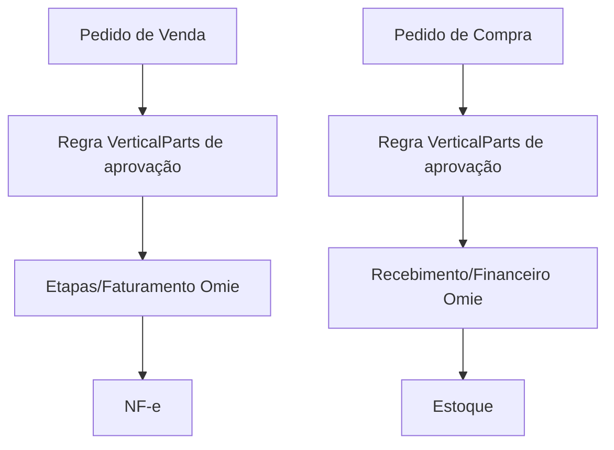

# GraphRAG - Aprovações

```mermaid
graph TD
  Venda["Pedido de Venda"] --> RegraVenda["Regra VerticalParts de aprovação"]
  Compra["Pedido de Compra"] --> RegraCompra["Regra VerticalParts de aprovação"]
  RegraVenda --> EtapaVenda["Etapas/Faturamento Omie"]
  RegraCompra --> Recebimento["Recebimento/Financeiro Omie"]
  EtapaVenda --> NFe["NF-e"]
  Recebimento --> Estoque["Estoque"]
```
