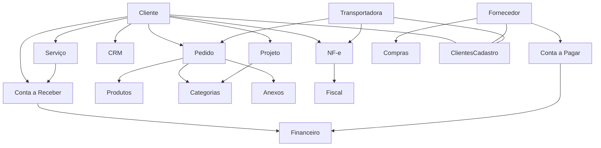

# GraphRAG: Omie Clientes

## Objetivo

Representar relacoes entre o cadastro central de clientes/fornecedores/transportadoras e dominios operacionais do ERP.

## Leitura para LLM

A mesma entidade cadastral pode assumir papel de cliente, fornecedor ou transportadora. O papel operacional depende do fluxo em que o cadastro e usado: vendas, compras, financeiro, fiscal, servicos ou CRM.
