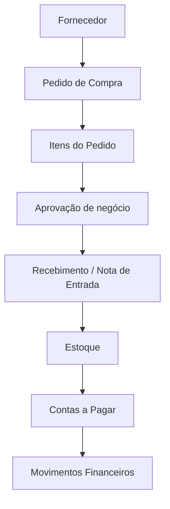

# GraphRAG - Fluxo Compra

```mermaid
graph TD
  Fornecedor["Fornecedor"] --> Pedido["Pedido de Compra"]
  Pedido --> Itens["Itens do Pedido"]
  Itens --> Aprovacao["Aprovação de negócio"]
  Aprovacao --> Recebimento["Recebimento / Nota de Entrada"]
  Recebimento --> Estoque["Estoque"]
  Estoque --> Pagar["Contas a Pagar"]
  Pagar --> MovFin["Movimentos Financeiros"]
```
