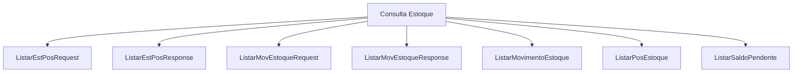

# GraphRAG - Consulta Estoque

```mermaid
graph TD
  S["Consulta Estoque"]
  S --> listarestposrequest["ListarEstPosRequest"]
  S --> listarestposresponse["ListarEstPosResponse"]
  S --> listarmovestoquerequest["ListarMovEstoqueRequest"]
  S --> listarmovestoqueresponse["ListarMovEstoqueResponse"]
  S --> listarmovimentoestoque["ListarMovimentoEstoque"]
  S --> listarposestoque["ListarPosEstoque"]
  S --> listarsaldopendente["ListarSaldoPendente"]
```
