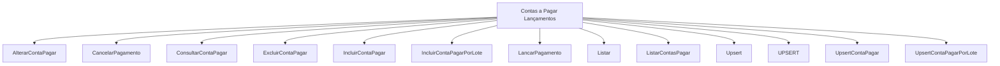

# GraphRAG - Contas a Pagar Lançamentos

```mermaid
graph TD
  S["Contas a Pagar Lançamentos"]
  S --> alterarcontapagar["AlterarContaPagar"]
  S --> cancelarpagamento["CancelarPagamento"]
  S --> consultarcontapagar["ConsultarContaPagar"]
  S --> excluircontapagar["ExcluirContaPagar"]
  S --> incluircontapagar["IncluirContaPagar"]
  S --> incluircontapagarporlote["IncluirContaPagarPorLote"]
  S --> lancarpagamento["LancarPagamento"]
  S --> listar["Listar"]
  S --> listarcontaspagar["ListarContasPagar"]
  S --> upsert_cadastro["Upsert"]
  S --> upsert_lote["UPSERT"]
  S --> upsertcontapagar["UpsertContaPagar"]
  S --> upsertcontapagarporlote["UpsertContaPagarPorLote"]
```
