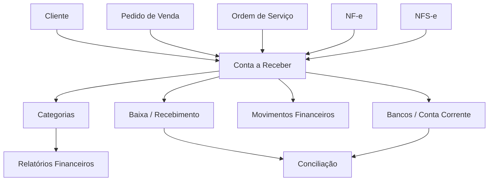

# GraphRAG: Omie Contas a Receber

```mermaid
graph TD
  Cliente["Cliente"] --> ContaReceber["Conta a Receber"]
  PedidoVenda["Pedido de Venda"] --> ContaReceber
  OrdemServico["Ordem de Serviço"] --> ContaReceber
  NFe["NF-e"] --> ContaReceber
  NFSe["NFS-e"] --> ContaReceber
  ContaReceber --> Categorias["Categorias"]
  ContaReceber --> Bancos["Bancos / Conta Corrente"]
  ContaReceber --> Movimentos["Movimentos Financeiros"]
  ContaReceber --> Baixa["Baixa / Recebimento"]
  Baixa --> Conciliacao["Conciliação"]
  Categorias --> Relatorios["Relatórios Financeiros"]
  Bancos --> Conciliacao
```

## Uso por LLM

Use este grafo para expandir perguntas que mencionem recebíveis, baixa, conciliação, cliente, pedido, nota fiscal, banco ou categoria.
