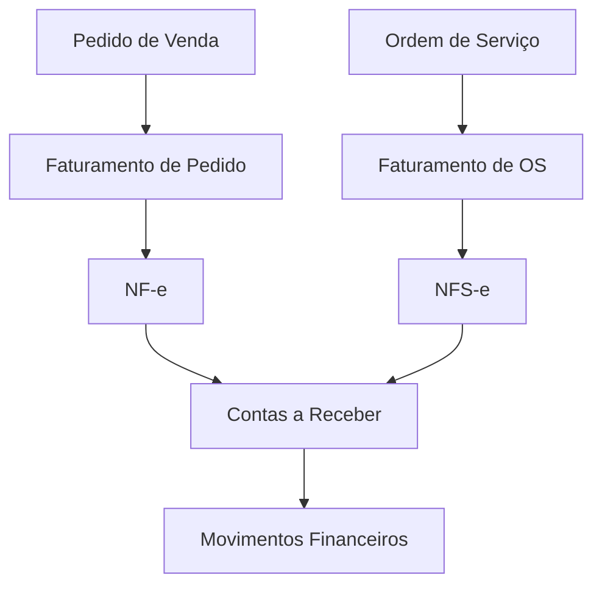

# GraphRAG - Faturamento

```mermaid
graph TD
  Venda["Pedido de Venda"] --> FatVenda["Faturamento de Pedido"]
  Servico["Ordem de Serviço"] --> FatServico["Faturamento de OS"]
  FatVenda --> NFe["NF-e"]
  FatServico --> NFSe["NFS-e"]
  NFe --> Receber["Contas a Receber"]
  NFSe --> Receber
  Receber --> Movimento["Movimentos Financeiros"]
```
