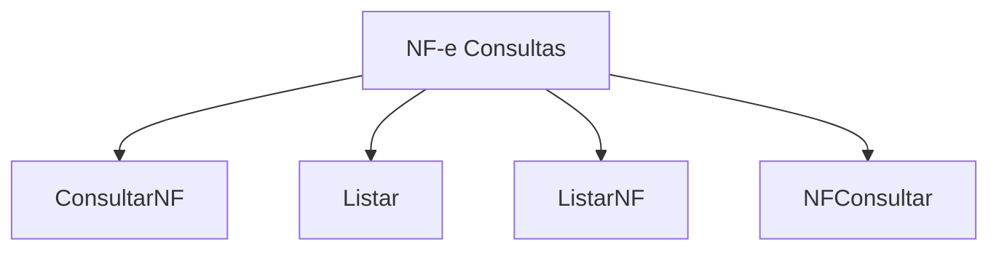

# GraphRAG - NF-e Consultas

```mermaid
graph TD
  S["NF-e Consultas"]
  S --> consultarnf["ConsultarNF"]
  S --> listar["Listar"]
  S --> listarnf["ListarNF"]
  S --> nfconsultar["NFConsultar"]
```
