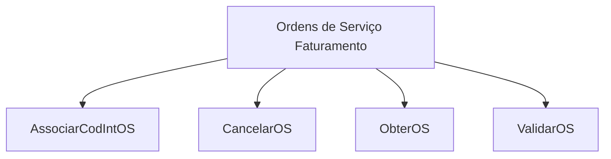

# GraphRAG - Ordens de Serviço Faturamento

```mermaid
graph TD
  S["Ordens de Serviço Faturamento"]
  S --> associarcodintos["AssociarCodIntOS"]
  S --> cancelaros["CancelarOS"]
  S --> obteros["ObterOS"]
  S --> validaros["ValidarOS"]
```
