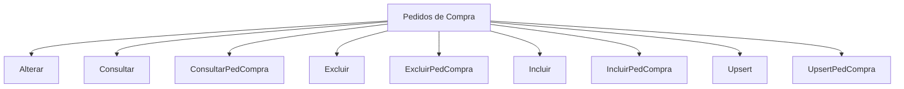

# GraphRAG - Pedidos de Compra

```mermaid
graph TD
  S["Pedidos de Compra"]
  S --> alterar["Alterar"]
  S --> consultar["Consultar"]
  S --> consultarpedcompra["ConsultarPedCompra"]
  S --> excluir["Excluir"]
  S --> excluirpedcompra["ExcluirPedCompra"]
  S --> incluir["Incluir"]
  S --> incluirpedcompra["IncluirPedCompra"]
  S --> upsert["Upsert"]
  S --> upsertpedcompra["UpsertPedCompra"]
```
