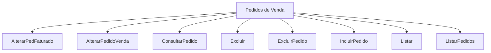

# GraphRAG - Pedidos de Venda

```mermaid
graph TD
  S["Pedidos de Venda"]
  S --> alterarpedfaturado["AlterarPedFaturado"]
  S --> alterarpedidovenda["AlterarPedidoVenda"]
  S --> consultarpedido["ConsultarPedido"]
  S --> excluir["Excluir"]
  S --> excluirpedido["ExcluirPedido"]
  S --> incluirpedido["IncluirPedido"]
  S --> listar["Listar"]
  S --> listarpedidos["ListarPedidos"]
```
