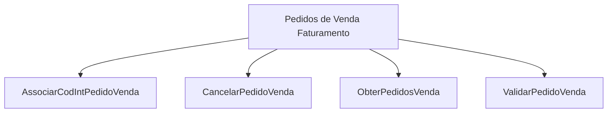

# GraphRAG - Pedidos de Venda Faturamento

```mermaid
graph TD
  S["Pedidos de Venda Faturamento"]
  S --> associarcodintpedidovenda["AssociarCodIntPedidoVenda"]
  S --> cancelarpedidovenda["CancelarPedidoVenda"]
  S --> obterpedidosvenda["ObterPedidosVenda"]
  S --> validarpedidovenda["ValidarPedidoVenda"]
```
