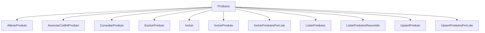

# GraphRAG - Produtos

```mermaid
graph TD
  S["Produtos"]
  S --> alterarproduto["AlterarProduto"]
  S --> associarcodintproduto["AssociarCodIntProduto"]
  S --> consultarproduto["ConsultarProduto"]
  S --> excluirproduto["ExcluirProduto"]
  S --> incluir["Incluir"]
  S --> incluirproduto["IncluirProduto"]
  S --> incluirprodutosporlote["IncluirProdutosPorLote"]
  S --> listarprodutos["ListarProdutos"]
  S --> listarprodutosresumido["ListarProdutosResumido"]
  S --> upsertproduto["UpsertProduto"]
  S --> upsertprodutosporlote["UpsertProdutosPorLote"]
```
