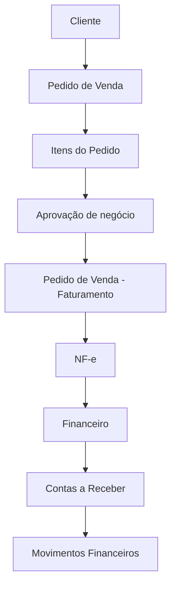

# GraphRAG - Fluxo Venda

```mermaid
graph TD
  Cliente["Cliente"] --> Pedido["Pedido de Venda"]
  Pedido --> Itens["Itens do Pedido"]
  Itens --> Aprovacao["Aprovação de negócio"]
  Aprovacao --> Faturamento["Pedido de Venda - Faturamento"]
  Faturamento --> NFe["NF-e"]
  NFe --> Financeiro["Financeiro"]
  Financeiro --> Receber["Contas a Receber"]
  Receber --> MovFin["Movimentos Financeiros"]
```
