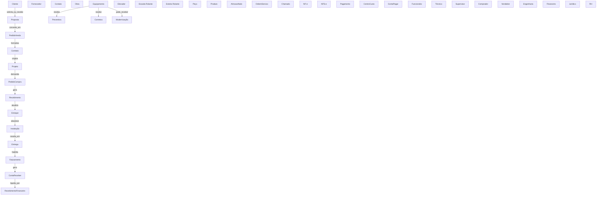

# GraphRAG - Master Ontology VerticalParts

Status: Aguardando modelagem da VerticalParts

```mermaid
graph TD
  Cliente["Cliente"]
  Fornecedor["Fornecedor"]
  Contato["Contato"]
  Obra["Obra"]
  Projeto["Projeto"]
  Equipamento["Equipamento"]
  Elevador["Elevador"]
  Escada_Rolante["Escada Rolante"]
  Esteira_Rolante["Esteira Rolante"]
  Peça["Peça"]
  Produto["Produto"]
  Almoxarifado["Almoxarifado"]
  Estoque["Estoque"]
  PedidoVenda["PedidoVenda"]
  PedidoCompra["PedidoCompra"]
  Contrato["Contrato"]
  Proposta["Proposta"]
  OrdemServico["OrdemServico"]
  Chamado["Chamado"]
  Preventiva["Preventiva"]
  Corretiva["Corretiva"]
  Modernização["Modernização"]
  Instalação["Instalação"]
  Entrega["Entrega"]
  Recebimento["Recebimento"]
  Faturamento["Faturamento"]
  NFe["NF-e"]
  NFSe["NFS-e"]
  Pagamento["Pagamento"]
  RecebimentoFinanceiro["RecebimentoFinanceiro"]
  CentroCusto["CentroCusto"]
  ContaReceber["ContaReceber"]
  ContaPagar["ContaPagar"]
  Funcionário["Funcionário"]
  Técnico["Técnico"]
  Supervisor["Supervisor"]
  Comprador["Comprador"]
  Vendedor["Vendedor"]
  Engenharia["Engenharia"]
  Financeiro["Financeiro"]
  Jurídico["Jurídico"]
  RH["RH"]
  Cliente -->|solicita_ou_recebe| Proposta
  Proposta -->|converte_em| PedidoVenda
  PedidoVenda -->|formaliza| Contrato
  Contrato -->|origina| Projeto
  Projeto -->|demanda| PedidoCompra
  PedidoCompra -->|gera| Recebimento
  Recebimento -->|atualiza| Estoque
  Estoque -->|abastece| Instalação
  Instalação -->|resulta_em| Entrega
  Entrega -->|habilita| Faturamento
  Faturamento -->|gera| ContaReceber
  ContaReceber -->|liquida_por| RecebimentoFinanceiro
  Equipamento -->|recebe| Preventiva
  Equipamento -->|recebe| Corretiva
  Equipamento -->|pode_receber| Modernização
```
