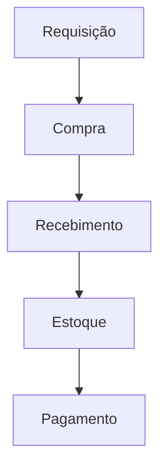

# GraphRAG - Procure to Pay

Status: Aguardando modelagem da VerticalParts

```mermaid
graph TD
  Requisição["Requisição"] --> Compra["Compra"]
  Compra["Compra"] --> Recebimento["Recebimento"]
  Recebimento["Recebimento"] --> Estoque["Estoque"]
  Estoque["Estoque"] --> Pagamento["Pagamento"]
```

> Estrutura conceitual inicial. Relações reais serão preenchidas posteriormente.
