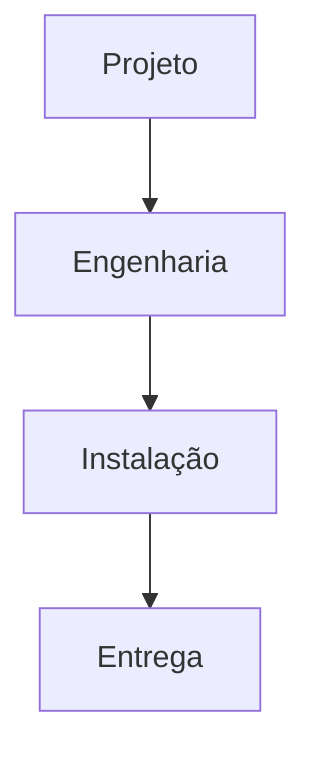

# GraphRAG - Project Installation

Status: Aguardando modelagem da VerticalParts

```mermaid
graph TD
  Projeto["Projeto"] --> Engenharia["Engenharia"]
  Engenharia["Engenharia"] --> Instalação["Instalação"]
  Instalação["Instalação"] --> Entrega["Entrega"]
```

> Estrutura conceitual inicial. Relações reais serão preenchidas posteriormente.
