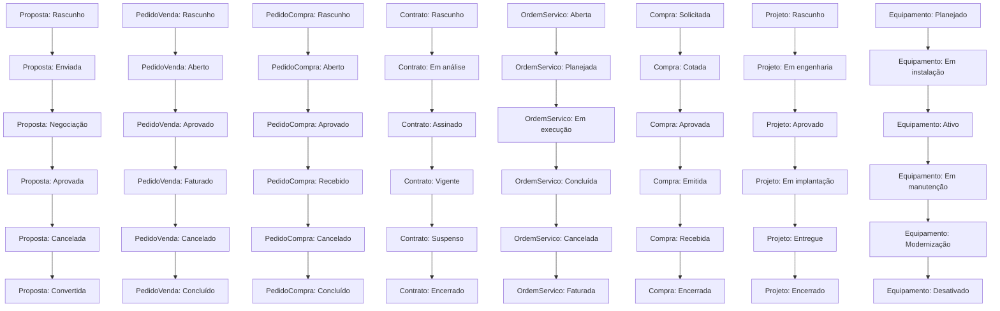

# GraphRAG - State Machine VerticalParts

Status: Aguardando modelagem da VerticalParts

```mermaid
graph TD
  Proposta_Rascunho["Proposta: Rascunho"] --> Proposta_Enviada["Proposta: Enviada"]
  Proposta_Enviada["Proposta: Enviada"] --> Proposta_Negociacao["Proposta: Negociação"]
  Proposta_Negociacao["Proposta: Negociação"] --> Proposta_Aprovada["Proposta: Aprovada"]
  Proposta_Aprovada["Proposta: Aprovada"] --> Proposta_Cancelada["Proposta: Cancelada"]
  Proposta_Cancelada["Proposta: Cancelada"] --> Proposta_Convertida["Proposta: Convertida"]
  PedidoVenda_Rascunho["PedidoVenda: Rascunho"] --> PedidoVenda_Aberto["PedidoVenda: Aberto"]
  PedidoVenda_Aberto["PedidoVenda: Aberto"] --> PedidoVenda_Aprovado["PedidoVenda: Aprovado"]
  PedidoVenda_Aprovado["PedidoVenda: Aprovado"] --> PedidoVenda_Faturado["PedidoVenda: Faturado"]
  PedidoVenda_Faturado["PedidoVenda: Faturado"] --> PedidoVenda_Cancelado["PedidoVenda: Cancelado"]
  PedidoVenda_Cancelado["PedidoVenda: Cancelado"] --> PedidoVenda_Concluído["PedidoVenda: Concluído"]
  PedidoCompra_Rascunho["PedidoCompra: Rascunho"] --> PedidoCompra_Aberto["PedidoCompra: Aberto"]
  PedidoCompra_Aberto["PedidoCompra: Aberto"] --> PedidoCompra_Aprovado["PedidoCompra: Aprovado"]
  PedidoCompra_Aprovado["PedidoCompra: Aprovado"] --> PedidoCompra_Recebido["PedidoCompra: Recebido"]
  PedidoCompra_Recebido["PedidoCompra: Recebido"] --> PedidoCompra_Cancelado["PedidoCompra: Cancelado"]
  PedidoCompra_Cancelado["PedidoCompra: Cancelado"] --> PedidoCompra_Concluído["PedidoCompra: Concluído"]
  Contrato_Rascunho["Contrato: Rascunho"] --> Contrato_Em_análise["Contrato: Em análise"]
  Contrato_Em_análise["Contrato: Em análise"] --> Contrato_Assinado["Contrato: Assinado"]
  Contrato_Assinado["Contrato: Assinado"] --> Contrato_Vigente["Contrato: Vigente"]
  Contrato_Vigente["Contrato: Vigente"] --> Contrato_Suspenso["Contrato: Suspenso"]
  Contrato_Suspenso["Contrato: Suspenso"] --> Contrato_Encerrado["Contrato: Encerrado"]
  OrdemServico_Aberta["OrdemServico: Aberta"] --> OrdemServico_Planejada["OrdemServico: Planejada"]
  OrdemServico_Planejada["OrdemServico: Planejada"] --> OrdemServico_Em_execucao["OrdemServico: Em execução"]
  OrdemServico_Em_execucao["OrdemServico: Em execução"] --> OrdemServico_Concluída["OrdemServico: Concluída"]
  OrdemServico_Concluída["OrdemServico: Concluída"] --> OrdemServico_Cancelada["OrdemServico: Cancelada"]
  OrdemServico_Cancelada["OrdemServico: Cancelada"] --> OrdemServico_Faturada["OrdemServico: Faturada"]
  Compra_Solicitada["Compra: Solicitada"] --> Compra_Cotada["Compra: Cotada"]
  Compra_Cotada["Compra: Cotada"] --> Compra_Aprovada["Compra: Aprovada"]
  Compra_Aprovada["Compra: Aprovada"] --> Compra_Emitida["Compra: Emitida"]
  Compra_Emitida["Compra: Emitida"] --> Compra_Recebida["Compra: Recebida"]
  Compra_Recebida["Compra: Recebida"] --> Compra_Encerrada["Compra: Encerrada"]
  Projeto_Rascunho["Projeto: Rascunho"] --> Projeto_Em_engenharia["Projeto: Em engenharia"]
  Projeto_Em_engenharia["Projeto: Em engenharia"] --> Projeto_Aprovado["Projeto: Aprovado"]
  Projeto_Aprovado["Projeto: Aprovado"] --> Projeto_Em_implantacao["Projeto: Em implantação"]
  Projeto_Em_implantacao["Projeto: Em implantação"] --> Projeto_Entregue["Projeto: Entregue"]
  Projeto_Entregue["Projeto: Entregue"] --> Projeto_Encerrado["Projeto: Encerrado"]
  Equipamento_Planejado["Equipamento: Planejado"] --> Equipamento_Em_instalacao["Equipamento: Em instalação"]
  Equipamento_Em_instalacao["Equipamento: Em instalação"] --> Equipamento_Ativo["Equipamento: Ativo"]
  Equipamento_Ativo["Equipamento: Ativo"] --> Equipamento_Em_manutencao["Equipamento: Em manutenção"]
  Equipamento_Em_manutencao["Equipamento: Em manutenção"] --> Equipamento_Modernizacao["Equipamento: Modernização"]
  Equipamento_Modernizacao["Equipamento: Modernização"] --> Equipamento_Desativado["Equipamento: Desativado"]
```
